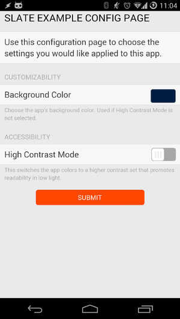

# design-guides-slate-config

Example app demonstrating the use of the 
[Slate CSS library](https://github.com/pebble/slate) to create a good-looking
[app configuration](http://developer.getpebble.com/guides/pebble-apps/pebblekit-js/app-configuration/) 
page. 

The page is styled with the Slate library, with classes selected for `
`
elements, including many control types such as:

* Text fields
* Buttons
* Color pickers
* Tab bars
* Toggles
* Checkboxes
* Radio buttons
* Date and time pickers
* Sliders
* Draggable lists

The example implemented here uses two of these components to implement color
options into a Pebble app. Using the config page it is possible to choose a
background color (with foreground color automatically determined for
visibility), or a high-contrast mode that overrides the colors chosen to promote
readability.

The result of hitting 'Submit' in the config page when the app is installed
results in the following app look and feel:

